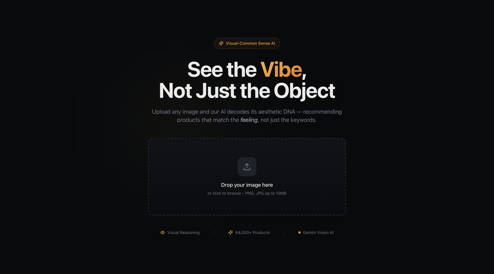
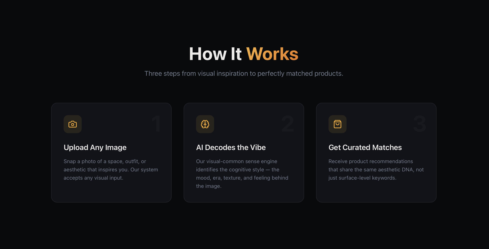

  <h1>Visual-Common Sense Recommender</h1>
  
<strong>AI-Driven Aesthetic Discovery Engine | Vision Transformer (ViT) | Latent Vibe Analysis</strong>

---

## Project Concept
The **Visual-Common Sense Recommender** is an advanced style discovery engine that moves beyond simple pixel-matching. It identifies "Cognitive Aesthetics"—the underlying theme or "vibe" of an image—to suggest products that are logically and aesthetically complementary.

### The "Common Sense" Bridge
While traditional engines find similar items, this system bridges the gap between raw visual inputs (an image of a room) and high-level design themes (suggesting a specific style of apparel or decor) using **latent space mapping**.

---

## Technical Workflow
* **Feature Extraction:** Utilizes a **Vision Transformer (ViT)** pipeline to capture global context and fine-grained visual patches.
* **Aesthetic Embedding:** Maps images into a high-dimensional latent space where "style-related" items cluster together.
* **Vector Search:** Implemented **FAISS (Facebook AI Similarity Search)** for lightning-fast retrieval of complementary products from large datasets.
* **Style Synthesis:** Interprets the "vibe" (e.g., Minimalist, Industrial, Bohemian) to ensure recommendations feel intuitive and human-like.

---

## Key Features
* **Vibe-Based Discovery:** Upload a photo of a space to find lifestyle products that "fit the mood."
* **Multimodal Alignment:** Translates visual cues into design-logic categories.
* **High-Precision Retrieval:** Optimized similarity thresholds to ensure "Common Sense" logic in every recommendation.

---

## System Architecture
| Layer | Component | Function |
| :--- | :--- | :--- |
| **Encoder** | Vision Transformer (ViT) | Extracts deep visual hierarchies |
| **Indexing** | FAISS / Vector DB | Efficient similarity search at scale |
| **Intelligence** | Latent Vibe Mapper | Logic-based category bridging |
| **Interface** | Minimalist-Tech UI | Seamless user-upload & discovery |

---

## Visual Discovery Preview

### System Overview

  

### System Working

  

---

## Author
**Mandar Deshmukh** *Computer Science & Engineering* [LinkedIn](https://linkedin.com/in/your-profile) | [GitHub](https://github.com/your-username)

---

  Decoding the latent language of aesthetics.

